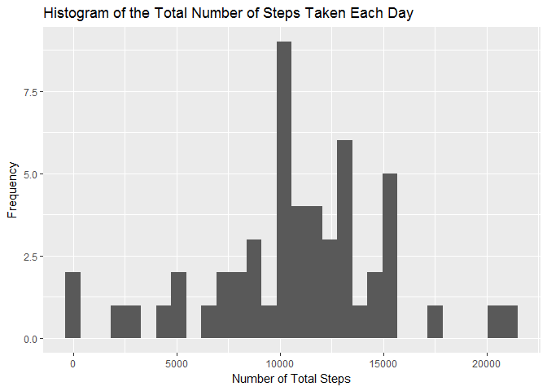
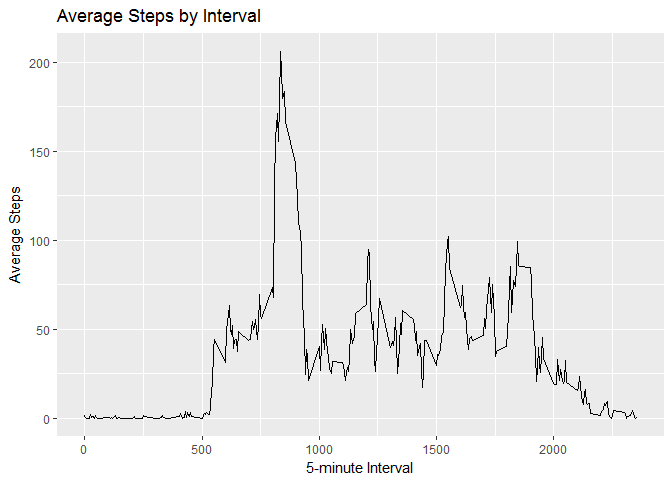
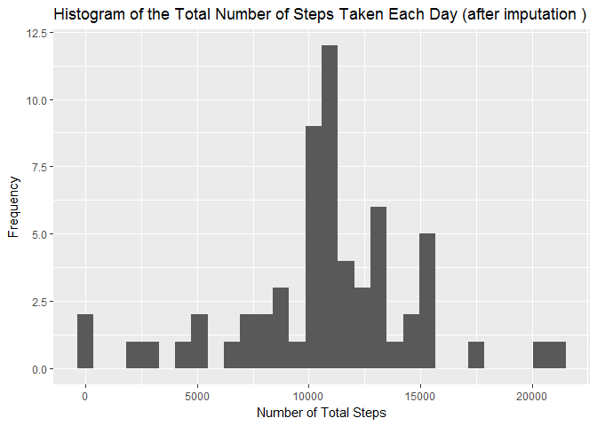
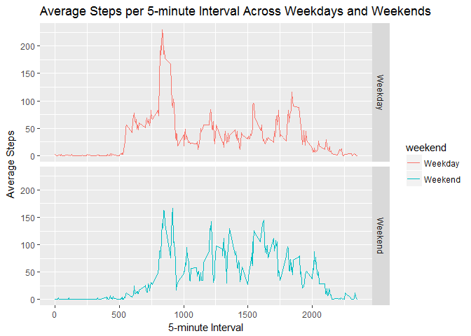

1. Loading and preprocessing the data
-------------------------------------

### 1.1 Load the data

    Data <- read.csv("activity.csv")

### 1.2 Revise date variable

    Data$date <- as.Date(as.character(Data$date))

2. What is mean total number of steps taken per day?
----------------------------------------------------

#### Ignore the missing values in the dataset

### 2.1 Calculate the total number of steps taken per day

    SumStepsByDay <- aggregate(steps ~ date, Data, sum)

### 2.2 Histogram of the total number of steps taken each day

    library(ggplot2)
    ggplot(SumStepsByDay, aes(x = steps)) +
      geom_histogram() +
      labs(title = "Histogram of the Total Number of Steps Taken Each Day", 
           x = "Number of Total Steps", y = "Frequency")

    ## `stat_bin()` using `bins = 30`. Pick better value with `binwidth`.

### 2.3 Calculate and report the mean and median of the total number of steps taken per day

    mean(SumStepsByDay$steps)

    ## [1] 10766.19

    median(SumStepsByDay$steps)

    ## [1] 10765

3. What is the average daily activity pattern?
----------------------------------------------

### 3.1 Make a time series plot of the 5-minute interval (x-axis) and the average number of steps taken, averaged across all days (y-axis)

    MeanStepsByInterval <- aggregate(steps ~ interval, Data, mean)

    library(ggplot2)
    ggplot(MeanStepsByInterval, aes(x = interval, y=steps)) +
      labs(title = "Average Steps by Interval", x = "5-minute Interval", y = "Average Steps")+
      geom_line() 

### 3.2 Which 5-minute interval, on average across all the days in the dataset, contains the maximum number of steps?

    MaxStepsInterval <- MeanStepsByInterval[which.max(MeanStepsByInterval$steps),]
    MaxStepsInterval

    ##     interval    steps
    ## 104      835 206.1698

4. Imputing missing values
--------------------------

### 4.1 Calculate and report the total number of missing values in the dataset (i.e. the total number of rows with NAs)

    NA_Data <- subset(Data, is.na(Data$steps))
    dim(NA_Data)

    ## [1] 2304    3

### 4.2 Strategy: impute missing values by using the mean for that 5-minute interval

### 4.3 Create a new dataset that is equal to the original dataset but with the missing data filled in.

    NoNA_Data <- subset(Data, !is.na(Data$steps))

    Missing <- is.na(Data$steps)

    Interval_Mean <- tapply(NoNA_Data$steps, NoNA_Data$interval, mean, na.rm=TRUE, simplify=TRUE)

    Data_Impute <- Data

    Data_Impute$steps[Missing] <- Interval_Mean[as.character(Data_Impute$interval[Missing])]
    sum(is.na(Data_Impute))

    ## [1] 0

### 4.4 Histogram of the total number of steps taken each day (after imputation)

    SumStepsByDay_Impute <- aggregate(steps ~ date, Data_Impute, sum)

    library(ggplot2)
    ggplot(SumStepsByDay_Impute, aes(x = steps)) +
      geom_histogram() +
      labs(title = "Histogram of the Total Number of Steps Taken Each Day (after imputation )", 
           x = "Number of Total Steps", y = "Frequency")

    ## `stat_bin()` using `bins = 30`. Pick better value with `binwidth`.

### 4.5 Calculate and report the mean and median of the total number of steps taken per day (after imputation).

    mean(SumStepsByDay_Impute$steps)

    ## [1] 10766.19

    median(SumStepsByDay_Impute$steps)

    ## [1] 10766.19

#### Do these values differ from the estimates from the first part of the assignment?

     Before misisng value imputation, mean=10766.19 and median=10765.
     After missing value imputation, mean=10766.19, which has not changed. Median=10766.19, which has increased. 
     

#### What is the impact of imputing missing data on the estimates of the total daily number of steps?

     Using interval mean to fill in all the missing values in the dataset does not change the mean of the total number of steps per day. However, it makes the data more balanced in terms of skewness. 
     Before imputation, mean > median, the data is slightly right skewed. 
     After imputation, mean=median, the data is no long skewed.
     

5. Are there differences in activity patterns between weekdays and weekends?
----------------------------------------------------------------------------

### 5.1 Create a new factor variable in the dataset with two levels - "weekday" and "weekend" indicating whether a given date is a weekday or weekend day.

    Data_Impute$weekday <- weekdays(Data_Impute$date)
    Data_Impute$weekend <- ifelse (Data_Impute$weekday=="Saturday" | Data_Impute$weekday=="Sunday", "Weekend", "Weekday")

### 5.2 Make a panel plot containing a time series plot of the 5-minute interval (x-axis) and the average number of steps taken, averaged across all weekday days or weekend days (y-axis).

    MeanDataWeekendWeekday <- aggregate(steps ~ weekend + interval, Data_Impute, mean)

    library(ggplot2)
    ggplot(MeanDataWeekendWeekday, aes(x=interval, y=steps, color=weekend)) +
      geom_line() +
      facet_grid(weekend ~ .) +
      labs(title = "Average Steps per 5-minute Interval Across Weekdays and Weekends", x="5-minute Interval", y="Average Steps")

From the plot, there are differences between weekdays and weekend during
the 750 - 1000 5-minute intervals, which can correspond to the
morning/noon time of each day. Weekday tends to have more steps during
this time than weekend. This may be caused by work related activities.
In the later time of the day (afternoon/evening), weekend tends to have
more steps than weekday. This might be caused by fun weekend activities
at night.
